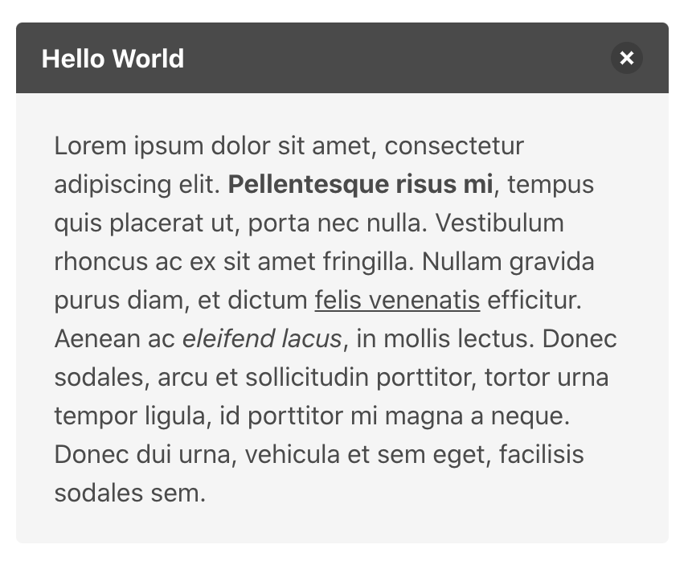

Bulma使用心得

基于Bootstrap开发的前端框架，使用flex布局，兼容IE10以上，内含多种实用模块，为前端快速开发带来新体验。使用sass语言开发。

<!--more-->

常用导航
-------

- [官方网站](https://bulma.io)

- [扩展模块](https://bulma.io/extensions/)

常用模块
-------

1. columns

  - 基础格式
  ```
    <div class="columns">
      <div class="column">1</div>
      <div class="column">2</div>
      <div class="column">3</div>
      <div class="column">4</div>
      <div class="column">5</div>
    </div>
  ```

  - 常用选项

    > 1. is-vcentered: 垂直居中
    >
    > 2. is-multiline: 自动折行
    >
    > 3. is-centered: 水平居中
    >
    > 4. is-narrow: 按实际大小排列

2. container

3. media

  - 基础格式

    

    ```
      <article class="media">
        <figure class="media-left">
          <p class="image is-64x64">
            
          </p>
        </figure>
        <div class="media-content">
          <div class="content">
            <p>
              <strong>John Smith</strong> <small>@johnsmith</small> <small>31m</small>
              <br>
              Lorem ipsum dolor sit amet, consectetur adipiscing elit. Proin ornare magna eros, eu pellentesque tortor vestibulum ut. Maecenas non massa sem. Etiam finibus odio quis feugiat facilisis.
            </p>
          </div>
          <nav class="level is-mobile">
            <div class="level-left">
              <a class="level-item">
                <span class="icon is-small"><i class="fas fa-reply"></i></span>
              </a>
              <a class="level-item">
                <span class="icon is-small"><i class="fas fa-retweet"></i></span>
              </a>
              <a class="level-item">
                <span class="icon is-small"><i class="fas fa-heart"></i></span>
              </a>
            </div>
          </nav>
        </div>
        <div class="media-right">
          <button class="delete"></button>
        </div>
      </article>
    ```

4. tiles

  - 基础格式

    

    ```
      <div class="tile is-ancestor">
        <div class="tile is-parent">
          <article class="tile is-child">
            <!-- Content -->
          </article>
        </div>
        <div class="tile is-parent">
          <article class="tile is-child">
            <!-- Content -->
          </article>
        </div>
      </div>
    ```

5. 表单元素

  > 为了保持ui样式平衡，不受浮动影响，提供了一个**control**容器
  >
  > 可以将表单元素用**field**包裹起来，保持固定间距

  - input

  - textarea

  - select

  - checkbox

  - radio

  - file

6. 常用元素

  - button

  - icon

  - image

7. 常用组件

  - card(卡片)

    

    > 代码格式

    ```
      <div class="card">
        <div class="card-image">
          <!-- image -->
        </div>
        <div class="card-content">
          <!-- content -->
        </div>
        <div class="card-foot">
          <!-- footer -->
        </div>  
      </div>
    ```

  - navbar(导航)

    

    > 代码格式

    ```
      <nav class="navbar" role="navigation" aria-label="main navigation">
        <div class="navbar-brand">
          <a class="navbar-item" href="https://bulma.io">
            
          </a>

          <a role="button" class="navbar-burger burger" aria-label="menu" aria-expanded="false" data-target="navbarBasicExample">
            <span aria-hidden="true"></span>
            <span aria-hidden="true"></span>
            <span aria-hidden="true"></span>
          </a>
        </div>

        <div id="navbarBasicExample" class="navbar-menu">
          <div class="navbar-start">
            <a class="navbar-item">
              Home
            </a>
            <a class="navbar-item">
              Documentation
            </a>
            <div class="navbar-item has-dropdown is-hoverable">
              <a class="navbar-link">
                More
              </a>

              <div class="navbar-dropdown">
                <a class="navbar-item">
                  About
                </a>
                <a class="navbar-item">
                  Jobs
                </a>
                <a class="navbar-item">
                  Contact
                </a>
                <hr class="navbar-divider">
                <a class="navbar-item">
                  Report an issue
                </a>
              </div>
            </div>
          </div>

          <div class="navbar-end">
            <div class="navbar-item">
              <div class="buttons">
                <a class="button is-primary">
                  <strong>Sign up</strong>
                </a>
                <a class="button is-light">
                  Log in
                </a>
              </div>
            </div>
          </div>
        </div>
      </nav>
    ```

  - dropdown(下拉弹窗)

    

    > 代码格式

    ```
      <nav class="navbar" role="navigation" aria-label="dropdown navigation">
        <div class="navbar-item has-dropdown is-active">
          <a class="navbar-link">
            Docs
          </a>

          <div class="navbar-dropdown">
            <a class="navbar-item">
              Overview
            </a>
            <a class="navbar-item">
              Elements
            </a>
            <a class="navbar-item">
              Components
            </a>
            <hr class="navbar-divider">
            <div class="navbar-item">
              Version 0.9.0
            </div>
          </div>
        </div>
      </nav>
    ```

  - menu(菜单)

    

    > 代码格式

    ```
      <aside class="menu">
        <p class="menu-label">
          General
        </p>
        <ul class="menu-list">
          <li><a>Dashboard</a></li>
          <li><a>Customers</a></li>
        </ul>
        <p class="menu-label">
          Administration
        </p>
        <ul class="menu-list">
          <li><a>Team Settings</a></li>
          <li>
            <a class="is-active">Manage Your Team</a>
            <ul>
              <li><a>Members</a></li>
              <li><a>Plugins</a></li>
              <li><a>Add a member</a></li>
            </ul>
          </li>
          <li><a>Invitations</a></li>
          <li><a>Cloud Storage Environment Settings</a></li>
          <li><a>Authentication</a></li>
        </ul>
        <p class="menu-label">
          Transactions
        </p>
        <ul class="menu-list">
          <li><a>Payments</a></li>
          <li><a>Transfers</a></li>
          <li><a>Balance</a></li>
        </ul>
      </aside>
    ```

  - pagination(分页)

    

    > 代码格式

    ```
      <nav class="pagination" role="navigation" aria-label="pagination">
        <a class="pagination-previous">Previous</a>
        <a class="pagination-next">Next page</a>
        <ul class="pagination-list">
          <li>
            <a class="pagination-link" aria-label="Goto page 1">1</a>
          </li>
          <li>
            <span class="pagination-ellipsis">&hellip;</span>
          </li>
          <li>
            <a class="pagination-link" aria-label="Goto page 45">45</a>
          </li>
          <li>
            <a class="pagination-link is-current" aria-label="Page 46" aria-current="page">46</a>
          </li>
          <li>
            <a class="pagination-link" aria-label="Goto page 47">47</a>
          </li>
          <li>
            <span class="pagination-ellipsis">&hellip;</span>
          </li>
          <li>
            <a class="pagination-link" aria-label="Goto page 86">86</a>
          </li>
        </ul>
      </nav>
    ```

  - modal(弹窗)

    

    > 代码格式

    ```
      <div class="modal">
        <div class="modal-background"></div>
        <div class="modal-content">
          <!-- Any other Bulma elements you want -->
        </div>
        <button class="modal-close is-large" aria-label="close"></button>
      </div>
    ```

8. 其他组件

  - message(消息)

    

    > 代码格式

    ```
      <article class="message">
        <div class="message-header">
          <p>Hello World</p>
          <button class="delete" aria-label="delete"></button>
        </div>
        <div class="message-body">
          Lorem ipsum dolor sit amet, consectetur adipiscing elit. <strong>Pellentesque risus mi</strong>, tempus quis placerat ut, porta nec nulla. Vestibulum rhoncus ac ex sit amet fringilla. Nullam gravida purus diam, et dictum <a>felis venenatis</a> efficitur. Aenean ac <em>eleifend lacus</em>, in mollis lectus. Donec sodales, arcu et sollicitudin porttitor, tortor urna tempor ligula, id porttitor mi magna a neque. Donec dui urna, vehicula et sem eget, facilisis sodales sem.
        </div>
      </article>
    ```

  - breadcrumb(面包屑)

    

    > 代码格式

    ```
      <nav class="breadcrumb" aria-label="breadcrumbs">
        <ul>
          <li><a href="#">Bulma</a></li>
          <li><a href="#">Documentation</a></li>
          <li><a href="#">Components</a></li>
          <li class="is-active"><a href="#" aria-current="page">Breadcrumb</a></li>
        </ul>
      </nav>
    ```

  - panel(面板)

    

    > 代码格式

    ```
      <nav class="panel">
        <p class="panel-heading">
          Repositories
        </p>
        <div class="panel-block">
          <p class="control has-icons-left">
            <input class="input" type="text" placeholder="Search">
            <span class="icon is-left">
              <i class="fas fa-search" aria-hidden="true"></i>
            </span>
          </p>
        </div>
        <p class="panel-tabs">
          <a class="is-active">All</a>
          <a>Public</a>
          <a>Private</a>
          <a>Sources</a>
          <a>Forks</a>
        </p>
        <a class="panel-block is-active">
          <span class="panel-icon">
            <i class="fas fa-book" aria-hidden="true"></i>
          </span>
          bulma
        </a>
        <a class="panel-block">
          <span class="panel-icon">
            <i class="fas fa-book" aria-hidden="true"></i>
          </span>
          marksheet
        </a>
        <a class="panel-block">
          <span class="panel-icon">
            <i class="fas fa-book" aria-hidden="true"></i>
          </span>
          minireset.css
        </a>
        <a class="panel-block">
          <span class="panel-icon">
            <i class="fas fa-book" aria-hidden="true"></i>
          </span>
          jgthms.github.io
        </a>
        <a class="panel-block">
          <span class="panel-icon">
            <i class="fas fa-code-branch" aria-hidden="true"></i>
          </span>
          daniellowtw/infboard
        </a>
        <a class="panel-block">
          <span class="panel-icon">
            <i class="fas fa-code-branch" aria-hidden="true"></i>
          </span>
          mojs
        </a>
        <label class="panel-block">
          <input type="checkbox">
          remember me
        </label>
        <div class="panel-block">
          <button class="button is-link is-outlined is-fullwidth">
            Reset all filters
          </button>
        </div>
      </nav>
    ```

  - tabs(标签)

    

    > 代码格式

    ```
      <div class="tabs is-centered">
        <ul>
          <li class="is-active"><a>Pictures</a></li>
          <li><a>Music</a></li>
          <li><a>Videos</a></li>
          <li><a>Documents</a></li>
        </ul>
      </div>
    ```
